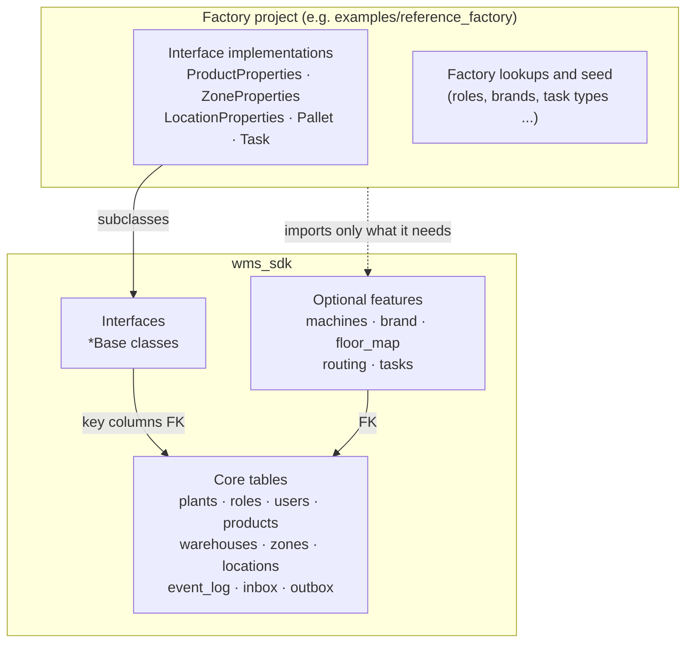
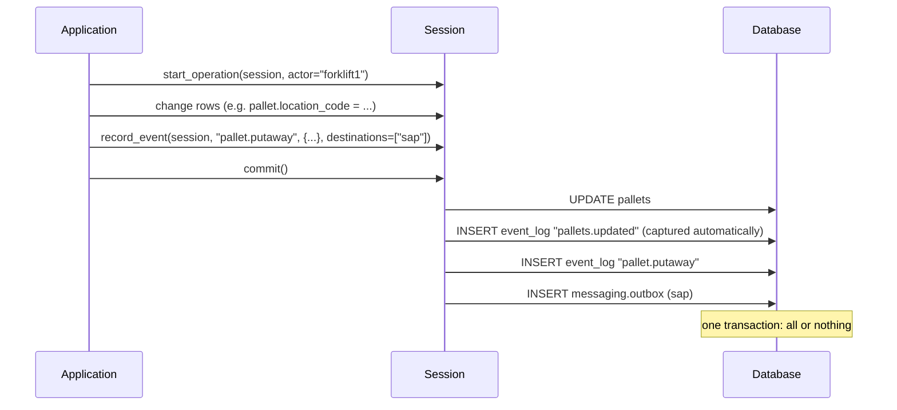

# Overview

[ภาษาไทย](../th/overview.md) | **English**

The WMS SDK is a shared database design for warehouses. It is a Python package of SQLAlchemy models plus a few helpers. Each factory installs it and builds its own project on top.

## What is in the box

| Layer | What it is | Who writes it |
|---|---|---|
| **core** | tables every warehouse needs | the SDK |
| **interface** | a table whose key the SDK fixes and whose other columns the factory adds | SDK: key; factory: columns |
| **feature** | optional tables and helpers; absent unless imported | the SDK |
| **factory project** | implementations, lookups, seed, migrations, the application | the factory |

Why it is designed this way: [Design concepts](concepts.md). Unfamiliar words: [Glossary](glossary.md).

## What happens on one user action

- **Current state** lives in the tables (`pallets`, `locations`, `tasks` ...)
- **History** lives in `event_log`, written in the same transaction
- **Messages to other systems** wait in `messaging.outbox` until a worker sends them

Details: [Event log, inbox, outbox](events.md).

## Where to start

| You want to | Read |
|---|---|
| understand the design | this page → [Design concepts](concepts.md) → [Glossary](glossary.md) |
| build a factory project | [Installation](installation.md) → [Tutorial](tutorial.md) → [Building a factory project](factory-guide.md) |
| write application code | [Examples](examples.md) → [Stock, pallets and QC](inventory.md) → [Optional features](features.md) → [API reference](api.md) |
| change the SDK | [Getting started](getting-started.md) → [CLAUDE.md](../../CLAUDE.md) |
| fix an error | [Troubleshooting](troubleshooting.md) |
| look up a table | [Schema reference](schema.md) |
