# Schema reference

> Generated by `python -m dev.gen_schema_doc`. Do not edit by hand.

[ภาษาไทย](../th/schema.md) | **English**

Covers the whole SDK plus the `reference_factory` example, which implements every interface and enables every feature. Types are shown as created on SQL Server.

- ⁽ᶠ⁾ marks a column the factory added to an interface; it is not from the SDK.
- `→ table.column` is a foreign key; multi-column FKs are listed under “Rules”.

## Contents

- **Shared data** (core): `plants`, `roles`, `users`
- **Products** (core): `products`, `plant_products`, `product_properties`
- **Storage structure** (core): `warehouses`, `zones`, `locations`, `zone_properties`, `location_properties`
- **Stock** (core): `pallets`
- **Events and integration** (core): `messaging.inbox`, `event_log`, `messaging.outbox`
- **Feature: machines** (optional): `machine_groups`, `machines`, `product_source_machines`
- **Feature: brand** (optional): `brands`
- **Feature: floor_map** (optional): `floor_images`, `warehouse_maps`, `warehouse_map_points`, `location_maps`
- **Feature: routing** (optional): `route_maps`, `route_vertices`, `location_access_points`, `route_edges`
- **Feature: tasks** (optional): `task_statuses`, `task_types`, `tasks`
- **Example: reference_factory** (factory tables, not part of the SDK): `abc_classes`, `pallet_fills`, `ticket_formats`, `traffic_flows`

## How the groups connect

An arrow means tables in one group reference tables in the other. Each group below has its own diagram: a line is a foreign key, a bar at the parent end means required, a circle means optional.

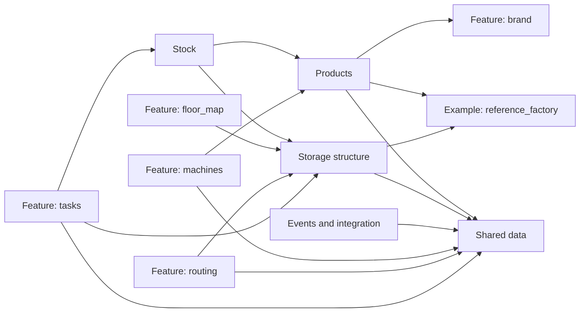

## Shared data

*core*

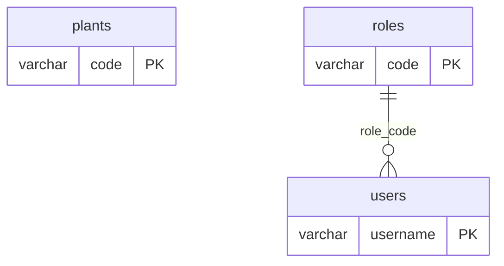

### `plants`

Factory plant. Other tables reference it by `code`.

| Column | Type | NULL | Key | Default |
|---|---|---|---|---|
| `code` | VARCHAR(10) |  | PK |  |
| `name` | NVARCHAR(50) |  |  |  |
| `deleted_at` | DATETIME2 | ✓ |  |  |
| `created_at` | DATETIME2 |  |  | sysutcdatetime() |
| `updated_at` | DATETIME2 |  |  | sysutcdatetime() |

Rules:

- UNIQUE (name)

### `roles`

*lookup, seeded by each factory*

User roles; each factory seeds its own set (e.g. 'Forklift', 'Lab').

| Column | Type | NULL | Key | Default |
|---|---|---|---|---|
| `code` | VARCHAR(30) |  | PK |  |
| `name` | NVARCHAR(100) |  |  |  |

### `users`

A person who performs warehouse actions; tables FK here to record who did what. Login and passwords belong to the application, not here.

| Column | Type | NULL | Key | Default |
|---|---|---|---|---|
| `username` | VARCHAR(150) |  | PK |  |
| `employee_id` | VARCHAR(50) |  |  |  |
| `first_name` | NVARCHAR(150) |  |  |  |
| `last_name` | NVARCHAR(150) |  |  |  |
| `email` | VARCHAR(254) | ✓ |  |  |
| `role_code` | VARCHAR(30) |  | → `roles.code` |  |
| `deleted_at` | DATETIME2 | ✓ |  |  |
| `created_at` | DATETIME2 |  |  | sysutcdatetime() |
| `updated_at` | DATETIME2 |  |  | sysutcdatetime() |

Rules:

- UNIQUE (employee_id)

## Products

*core*

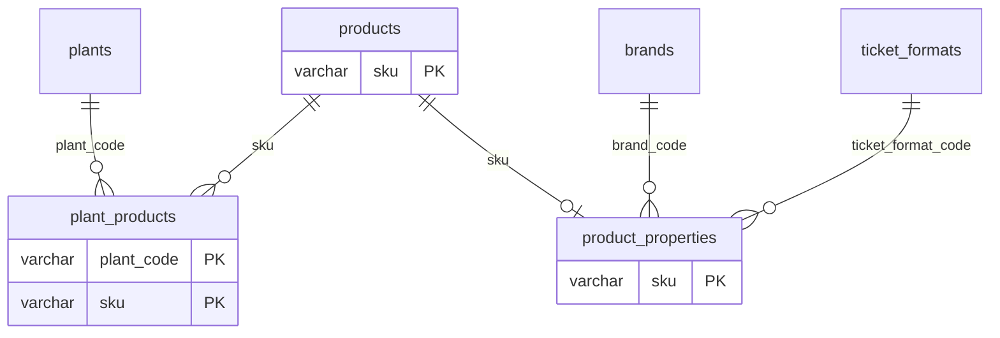

### `products`

Product identity only. Properties live in `product_properties`; a missing row means "not set" and must raise, never fall back to a default.

| Column | Type | NULL | Key | Default |
|---|---|---|---|---|
| `sku` | VARCHAR(50) |  | PK |  |
| `name_thai` | NVARCHAR(200) |  |  |  |
| `name_eng` | VARCHAR(200) |  |  |  |
| `name_short` | NVARCHAR(100) | ✓ |  |  |
| `deleted_at` | DATETIME2 | ✓ |  |  |
| `created_at` | DATETIME2 |  |  | sysutcdatetime() |
| `updated_at` | DATETIME2 |  |  | sysutcdatetime() |

### `plant_products`

A product that a plant produces. Stored explicitly (not inferred from machines) so a product is linked to a plant before any machine is chosen. Hard-deleted when the link ends.

| Column | Type | NULL | Key | Default |
|---|---|---|---|---|
| `plant_code` | VARCHAR(10) |  | PK → `plants.code` |  |
| `sku` | VARCHAR(50) |  | PK → `products.sku` |  |
| `created_at` | DATETIME2 |  |  | sysutcdatetime() |

Rules:

- INDEX (sku)

### `product_properties`

*interface `ProductPropertiesBase`, implemented by `examples.reference_factory.models.ProductProperties`*

**SDK:** Interface for the `product_properties` table: one optional row per sku. A missing row means "not set". The SDK fixes the properties every factory has (`pcs_per_pallet`, `kg_per_pcs`); the factory adds the rest.

| Column | Type | NULL | Key | Default |
|---|---|---|---|---|
| `sku` | VARCHAR(50) |  | PK → `products.sku` |  |
| `pcs_per_pallet` | INTEGER |  |  |  |
| `kg_per_pcs` | NUMERIC(10, 4) |  |  |  |
| `pcs_per_box` ⁽ᶠ⁾ | INTEGER | ✓ |  |  |
| `size` ⁽ᶠ⁾ | NVARCHAR(100) |  |  |  |
| `size_mm` ⁽ᶠ⁾ | VARCHAR(50) |  |  |  |
| `length_cm` ⁽ᶠ⁾ | INTEGER | ✓ |  |  |
| `tis` ⁽ᶠ⁾ | BIT |  |  |  |
| `ticket_format_code` ⁽ᶠ⁾ | VARCHAR(30) |  | → `ticket_formats.code` |  |
| `ticket_thai` ⁽ᶠ⁾ | NVARCHAR(150) | ✓ |  |  |
| `ticket_eng` ⁽ᶠ⁾ | VARCHAR(150) | ✓ |  |  |
| `customer_sku` ⁽ᶠ⁾ | VARCHAR(20) | ✓ |  |  |
| `created_at` | DATETIME2 |  |  | sysutcdatetime() |
| `updated_at` | DATETIME2 |  |  | sysutcdatetime() |
| `brand_code` ⁽ᶠ⁾ | VARCHAR(30) |  | → `brands.code` |  |

Rules:

- CHECK `kg_per_pcs > 0`
- CHECK `length_cm IS NULL OR length_cm > 0`
- CHECK `pcs_per_box IS NULL OR pcs_per_box > 0`
- CHECK `pcs_per_pallet > 0`

## Storage structure

*core*

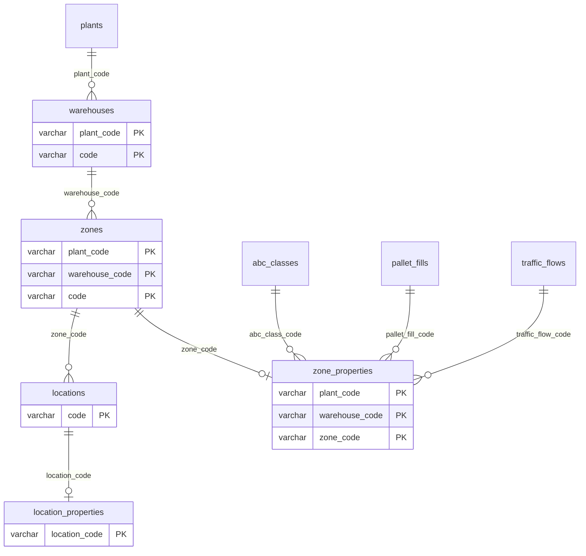

### `warehouses`

A storage building or area within a plant. Codes are unique per plant, not globally (two plants may both have a W3).

| Column | Type | NULL | Key | Default |
|---|---|---|---|---|
| `plant_code` | VARCHAR(10) |  | PK → `plants.code` |  |
| `code` | VARCHAR(20) |  | PK |  |
| `deleted_at` | DATETIME2 | ✓ |  |  |
| `created_at` | DATETIME2 |  |  | sysutcdatetime() |
| `updated_at` | DATETIME2 |  |  | sysutcdatetime() |

### `zones`

An area within a warehouse. Flat: zones do not nest.

| Column | Type | NULL | Key | Default |
|---|---|---|---|---|
| `plant_code` | VARCHAR(10) |  | PK → `warehouses.plant_code` |  |
| `warehouse_code` | VARCHAR(20) |  | PK → `warehouses.code` |  |
| `code` | VARCHAR(20) |  | PK |  |
| `deleted_at` | DATETIME2 | ✓ |  |  |
| `created_at` | DATETIME2 |  |  | sysutcdatetime() |
| `updated_at` | DATETIME2 |  |  | sysutcdatetime() |

Rules:

- FK (plant_code, warehouse_code) → `warehouses` (plant_code, code)

### `locations`

A place where goods are stored. Addressing and capacity differ per factory, so they live in `location_properties`.

| Column | Type | NULL | Key | Default |
|---|---|---|---|---|
| `code` | VARCHAR(50) |  | PK |  |
| `plant_code` | VARCHAR(10) |  | → `zones.plant_code` |  |
| `warehouse_code` | VARCHAR(20) |  | → `zones.warehouse_code` |  |
| `zone_code` | VARCHAR(20) |  | → `zones.code` |  |
| `is_enabled` | BIT |  |  | 1 |
| `deleted_at` | DATETIME2 | ✓ |  |  |
| `created_at` | DATETIME2 |  |  | sysutcdatetime() |
| `updated_at` | DATETIME2 |  |  | sysutcdatetime() |

Rules:

- FK (plant_code, warehouse_code, zone_code) → `zones` (plant_code, warehouse_code, code)
- UNIQUE (code, plant_code, warehouse_code)
- INDEX (plant_code, warehouse_code, zone_code)

### `zone_properties`

*interface `ZonePropertiesBase`, implemented by `examples.reference_factory.models.ZoneProperties`*

**SDK:** Interface for the `zone_properties` table: one optional row per zone, columns defined by the factory (e.g. traffic flow, ABC class). A missing row means "not set".

| Column | Type | NULL | Key | Default |
|---|---|---|---|---|
| `plant_code` | VARCHAR(10) |  | PK → `zones.plant_code` |  |
| `warehouse_code` | VARCHAR(20) |  | PK → `zones.warehouse_code` |  |
| `zone_code` | VARCHAR(20) |  | PK → `zones.code` |  |
| `traffic_flow_code` ⁽ᶠ⁾ | VARCHAR(30) |  | → `traffic_flows.code` |  |
| `pallet_fill_code` ⁽ᶠ⁾ | VARCHAR(30) |  | → `pallet_fills.code` |  |
| `abc_class_code` ⁽ᶠ⁾ | VARCHAR(30) |  | → `abc_classes.code` |  |
| `created_at` | DATETIME2 |  |  | sysutcdatetime() |
| `updated_at` | DATETIME2 |  |  | sysutcdatetime() |

Rules:

- FK (plant_code, warehouse_code, zone_code) → `zones` (plant_code, warehouse_code, code)

### `location_properties`

*interface `LocationPropertiesBase`, implemented by `examples.reference_factory.models.LocationProperties`*

**SDK:** Interface for the `location_properties` table: one optional row per location, columns defined by the factory (addressing, capacity). A missing row means "not set".

**Factory:** Floor-stacked pallet lanes: a location is one row of a column.

| Column | Type | NULL | Key | Default |
|---|---|---|---|---|
| `location_code` | VARCHAR(50) |  | PK → `locations.code` |  |
| `plant_code` ⁽ᶠ⁾ | VARCHAR(10) |  | → `locations.plant_code` |  |
| `warehouse_code` ⁽ᶠ⁾ | VARCHAR(20) |  | → `locations.warehouse_code` |  |
| `column_no` ⁽ᶠ⁾ | SMALLINT |  |  |  |
| `row_no` ⁽ᶠ⁾ | SMALLINT |  |  |  |
| `max_level` ⁽ᶠ⁾ | SMALLINT |  |  |  |
| `sub_column` ⁽ᶠ⁾ | SMALLINT |  |  |  |
| `pallet_length_cm` ⁽ᶠ⁾ | INTEGER |  |  |  |
| `created_at` | DATETIME2 |  |  | sysutcdatetime() |
| `updated_at` | DATETIME2 |  |  | sysutcdatetime() |

Rules:

- CHECK `column_no >= 1 AND row_no >= 1`
- CHECK `max_level >= 1 AND sub_column >= 1`
- CHECK `pallet_length_cm > 0`
- FK (location_code, plant_code, warehouse_code) → `locations` (code, plant_code, warehouse_code)
- UNIQUE (plant_code, warehouse_code, column_no, row_no)

## Stock

*core*

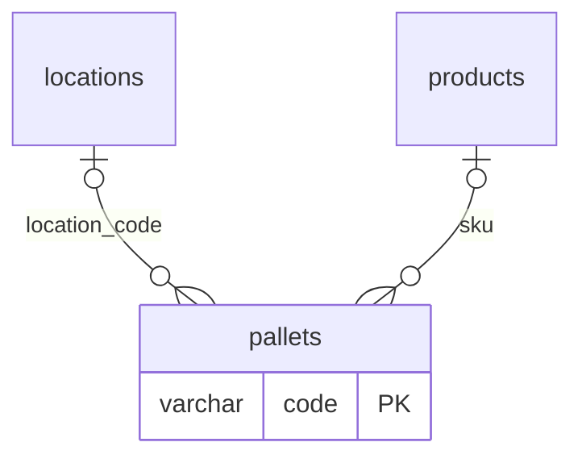

### `pallets`

*interface `PalletBase`, implemented by `examples.reference_factory.models.Pallet`*

**SDK:** Interface for the `pallets` table: one row per physical, reusable pallet. The goods on it (one sku, one lot) come and go; an empty pallet has no sku/lot/qty. Stock on hand is the sum of `qty` over pallets. Factories add position columns (e.g. level/slot).

**Factory:** Pallets are stacked in floor lanes, so a pallet's position is its location plus level (height) and slot (side by side).

| Column | Type | NULL | Key | Default |
|---|---|---|---|---|
| `code` | VARCHAR(50) |  | PK |  |
| `sku` | VARCHAR(50) | ✓ | → `products.sku` |  |
| `lot_no` | VARCHAR(50) | ✓ |  |  |
| `qty` | INTEGER | ✓ |  |  |
| `qc_status` | VARCHAR(10) | ✓ |  |  |
| `qc_lock_reason` | NVARCHAR(200) | ✓ |  |  |
| `location_code` | VARCHAR(50) | ✓ | → `locations.code` |  |
| `left_at` | DATETIME2 | ✓ |  |  |
| `level_no` ⁽ᶠ⁾ | SMALLINT | ✓ |  |  |
| `slot_no` ⁽ᶠ⁾ | SMALLINT | ✓ |  |  |
| `deleted_at` | DATETIME2 | ✓ |  |  |
| `created_at` | DATETIME2 |  |  | sysutcdatetime() |
| `updated_at` | DATETIME2 |  |  | sysutcdatetime() |

Rules:

- CHECK `deleted_at IS NULL OR (sku IS NULL AND location_code IS NULL)`
- CHECK `left_at IS NULL OR location_code IS NULL`
- CHECK `(sku IS NULL AND lot_no IS NULL AND qty IS NULL) OR (sku IS NOT NULL AND lot_no IS NOT NULL AND qty IS NOT NULL AND qty > 0)`
- CHECK `(level_no IS NULL AND slot_no IS NULL) OR (level_no IS NOT NULL AND slot_no IS NOT NULL AND level_no >= 1 AND slot_no >= 1 AND location_code IS NOT NULL)`
- CHECK `(qc_status IS NOT NULL AND qc_status = 'locked' AND qc_lock_reason IS NOT NULL AND qc_lock_reason <> '') OR ((qc_status IS NULL OR qc_status <> 'locked') AND qc_lock_reason IS NULL)`
- CHECK `pallets.qc_status IN ('waiting', 'locked', 'passed')`
- CHECK `(sku IS NULL AND qc_status IS NULL) OR (sku IS NOT NULL AND qc_status IS NOT NULL)`
- CHECK `location_code IS NULL OR sku IS NOT NULL`
- INDEX (location_code)
- INDEX (sku, lot_no)
- UNIQUE INDEX (location_code, level_no, slot_no) WHERE location_code IS NOT NULL

## Events and integration

*core*

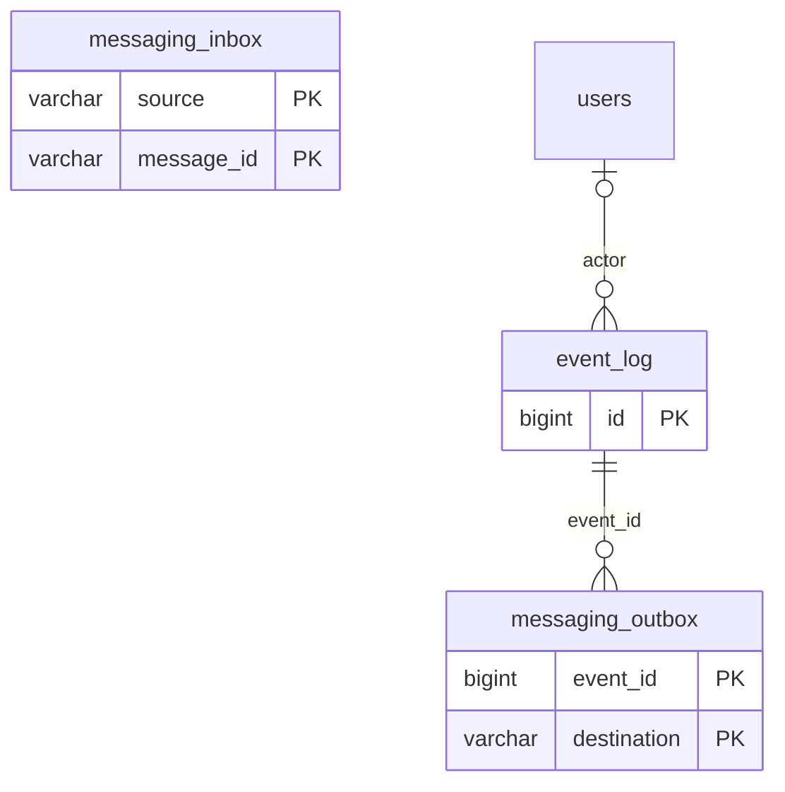

### `messaging.inbox`

Messages received from external systems, stored before processing. The key is the sender's own message id, so a message delivered twice is stored and processed only once.

| Column | Type | NULL | Key | Default |
|---|---|---|---|---|
| `source` | VARCHAR(50) |  | PK |  |
| `message_id` | VARCHAR(100) |  | PK |  |
| `message_type` | VARCHAR(100) |  |  |  |
| `payload` | NVARCHAR(max) |  |  |  |
| `received_at` | DATETIME2 |  |  | sysutcdatetime() |
| `processed_at` | DATETIME2 | ✓ |  |  |
| `attempts` | INTEGER |  |  | 0 |
| `last_error` | NVARCHAR(max) | ✓ |  |  |

Rules:

- CHECK `message_type LIKE '%_._%'`
- CHECK `ISJSON(payload) = 1`
- INDEX (received_at) WHERE processed_at IS NULL

### `event_log`

Everything that happened in the WMS, append-only. Two sources: data changes captured automatically (`<table>.inserted/updated/deleted`) and business events recorded by code (e.g. `putaway.completed`).

| Column | Type | NULL | Key | Default |
|---|---|---|---|---|
| `id` | BIGINT |  | PK |  |
| `event_type` | VARCHAR(100) |  |  |  |
| `subject_table` | VARCHAR(100) | ✓ |  |  |
| `subject_key` | NVARCHAR(400) | ✓ |  |  |
| `payload` | NVARCHAR(max) |  |  |  |
| `operation_id` | UNIQUEIDENTIFIER |  |  |  |
| `actor` | VARCHAR(150) | ✓ | → `users.username` |  |
| `occurred_at` | DATETIME2 |  |  | sysutcdatetime() |

Rules:

- CHECK `event_type LIKE '%_._%'`
- CHECK `ISJSON(payload) = 1`
- CHECK `(subject_table IS NULL AND subject_key IS NULL) OR (subject_table IS NOT NULL AND subject_key IS NOT NULL)`
- CHECK `subject_key IS NULL OR ISJSON(subject_key) = 1`
- INDEX (actor, occurred_at)
- INDEX (event_type, occurred_at)
- INDEX (operation_id)
- INDEX (subject_table, subject_key, occurred_at)

### `messaging.outbox`

Events waiting to be sent to an external system, one row per destination. Written in the same transaction as the event, so nothing is lost if sending fails; a worker sends rows where `sent_at` is NULL.

| Column | Type | NULL | Key | Default |
|---|---|---|---|---|
| `event_id` | BIGINT |  | PK → `event_log.id` |  |
| `destination` | VARCHAR(50) |  | PK |  |
| `sent_at` | DATETIME2 | ✓ |  |  |
| `attempts` | INTEGER |  |  | 0 |
| `last_error` | NVARCHAR(max) | ✓ |  |  |

Rules:

- INDEX (event_id) WHERE sent_at IS NULL

## Feature: machines

*optional*

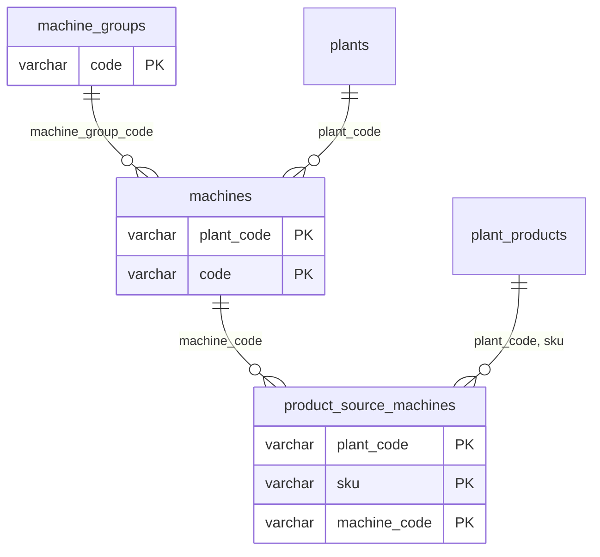

### `machine_groups`

*lookup, seeded by each factory*

| Column | Type | NULL | Key | Default |
|---|---|---|---|---|
| `code` | VARCHAR(30) |  | PK |  |
| `name` | NVARCHAR(100) |  |  |  |

### `machines`

Production machine. Codes are unique per plant, not globally.

| Column | Type | NULL | Key | Default |
|---|---|---|---|---|
| `plant_code` | VARCHAR(10) |  | PK → `plants.code` |  |
| `code` | VARCHAR(20) |  | PK |  |
| `machine_group_code` | VARCHAR(30) |  | → `machine_groups.code` |  |
| `deleted_at` | DATETIME2 | ✓ |  |  |
| `created_at` | DATETIME2 |  |  | sysutcdatetime() |
| `updated_at` | DATETIME2 |  |  | sysutcdatetime() |

### `product_source_machines`

A machine that produces a product at a plant. Hard-deleted when the link ends.

| Column | Type | NULL | Key | Default |
|---|---|---|---|---|
| `plant_code` | VARCHAR(10) |  | PK → `machines.plant_code` → `plant_products.plant_code` |  |
| `sku` | VARCHAR(50) |  | PK → `plant_products.sku` |  |
| `machine_code` | VARCHAR(20) |  | PK → `machines.code` |  |
| `created_at` | DATETIME2 |  |  | sysutcdatetime() |

Rules:

- FK (plant_code, machine_code) → `machines` (plant_code, code)
- FK (plant_code, sku) → `plant_products` (plant_code, sku) ON DELETE CASCADE
- INDEX (plant_code, machine_code)

## Feature: brand

*optional*

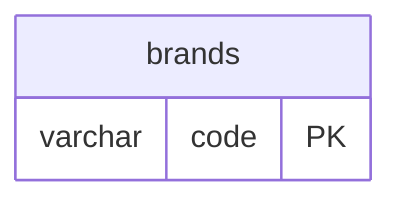

### `brands`

*lookup, seeded by each factory*

| Column | Type | NULL | Key | Default |
|---|---|---|---|---|
| `code` | VARCHAR(30) |  | PK |  |
| `name` | NVARCHAR(100) |  |  |  |

## Feature: floor_map

*optional*

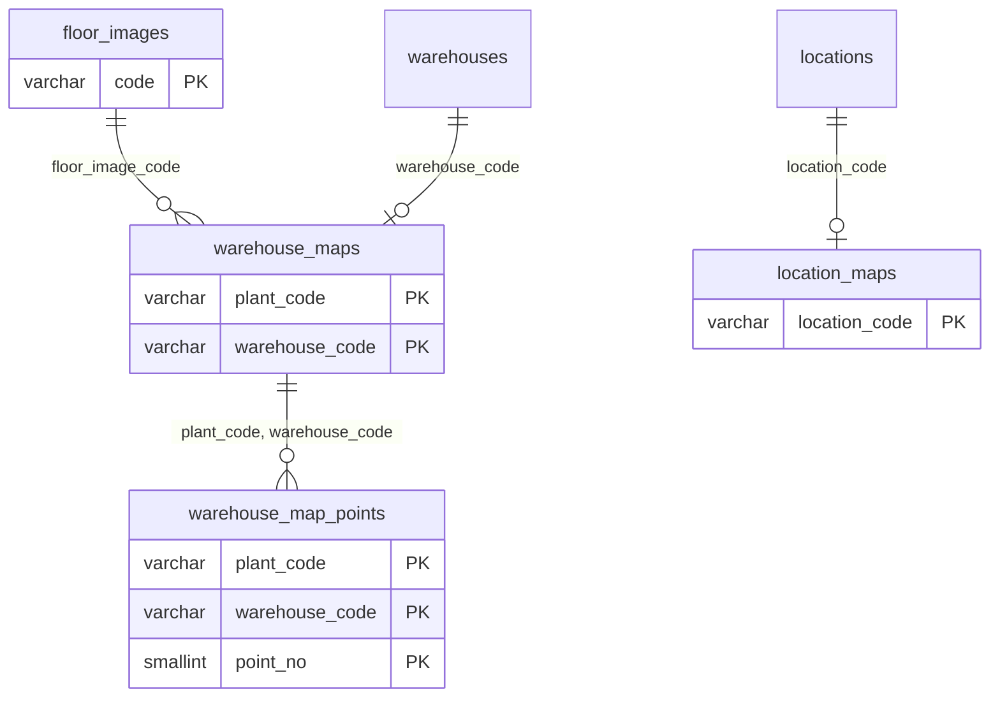

### `floor_images`

A picture of a site; warehouse outlines are drawn on it. Not tied to a plant: plants sharing one site share one picture.

| Column | Type | NULL | Key | Default |
|---|---|---|---|---|
| `code` | VARCHAR(30) |  | PK |  |
| `name` | NVARCHAR(100) |  |  |  |
| `image_path` | NVARCHAR(500) |  |  |  |
| `width` | NUMERIC(12, 4) |  |  |  |
| `height` | NUMERIC(12, 4) |  |  |  |
| `deleted_at` | DATETIME2 | ✓ |  |  |
| `created_at` | DATETIME2 |  |  | sysutcdatetime() |
| `updated_at` | DATETIME2 |  |  | sysutcdatetime() |

Rules:

- CHECK `width > 0 AND height > 0`

### `warehouse_maps`

Where a warehouse is drawn on its floor image. One row per warehouse.

| Column | Type | NULL | Key | Default |
|---|---|---|---|---|
| `plant_code` | VARCHAR(10) |  | PK → `warehouses.plant_code` |  |
| `warehouse_code` | VARCHAR(20) |  | PK → `warehouses.code` |  |
| `floor_image_code` | VARCHAR(30) |  | → `floor_images.code` |  |
| `x` | NUMERIC(12, 4) |  |  |  |
| `y` | NUMERIC(12, 4) |  |  |  |
| `width` | NUMERIC(12, 4) |  |  |  |
| `height` | NUMERIC(12, 4) |  |  |  |
| `rotation_deg` | NUMERIC(6, 2) |  |  | 0 |
| `background_path` | NVARCHAR(500) | ✓ |  |  |
| `metres_per_unit` | NUMERIC(12, 6) | ✓ |  |  |
| `created_at` | DATETIME2 |  |  | sysutcdatetime() |
| `updated_at` | DATETIME2 |  |  | sysutcdatetime() |

Rules:

- CHECK `rotation_deg >= -360 AND rotation_deg <= 360`
- CHECK `metres_per_unit IS NULL OR metres_per_unit > 0`
- CHECK `width > 0 AND height > 0`
- FK (plant_code, warehouse_code) → `warehouses` (plant_code, code)

### `warehouse_map_points`

Corner of a warehouse outline, as a 0..1 ratio of its bounding box before rotation. A warehouse with no points is drawn as the full box; otherwise it has exactly 4 (check with geometry.polygon_error).

| Column | Type | NULL | Key | Default |
|---|---|---|---|---|
| `plant_code` | VARCHAR(10) |  | PK → `warehouse_maps.plant_code` |  |
| `warehouse_code` | VARCHAR(20) |  | PK → `warehouse_maps.warehouse_code` |  |
| `point_no` | SMALLINT |  | PK |  |
| `x_ratio` | NUMERIC(9, 6) |  |  |  |
| `y_ratio` | NUMERIC(9, 6) |  |  |  |
| `created_at` | DATETIME2 |  |  | sysutcdatetime() |
| `updated_at` | DATETIME2 |  |  | sysutcdatetime() |

Rules:

- CHECK `point_no BETWEEN 1 AND 4`
- CHECK `x_ratio BETWEEN 0 AND 1 AND y_ratio BETWEEN 0 AND 1`
- FK (plant_code, warehouse_code) → `warehouse_maps` (plant_code, warehouse_code)

### `location_maps`

Where a location is drawn inside its warehouse drawing.

| Column | Type | NULL | Key | Default |
|---|---|---|---|---|
| `location_code` | VARCHAR(50) |  | PK → `locations.code` |  |
| `x` | NUMERIC(12, 4) |  |  |  |
| `y` | NUMERIC(12, 4) |  |  |  |
| `width` | NUMERIC(12, 4) |  |  |  |
| `height` | NUMERIC(12, 4) |  |  |  |
| `row_direction` | VARCHAR(10) |  |  |  |
| `row_gap` | NUMERIC(12, 4) |  |  | 0 |
| `level_gap` | NUMERIC(12, 4) |  |  | 0 |
| `label_gap` | NUMERIC(12, 4) |  |  | 0 |
| `created_at` | DATETIME2 |  |  | sysutcdatetime() |
| `updated_at` | DATETIME2 |  |  | sysutcdatetime() |

Rules:

- CHECK `row_gap >= 0 AND level_gap >= 0 AND label_gap >= 0`
- CHECK `location_maps.row_direction IN ('up', 'down', 'left', 'right')`
- CHECK `width >= 0 AND height >= 0`

## Feature: routing

*optional*

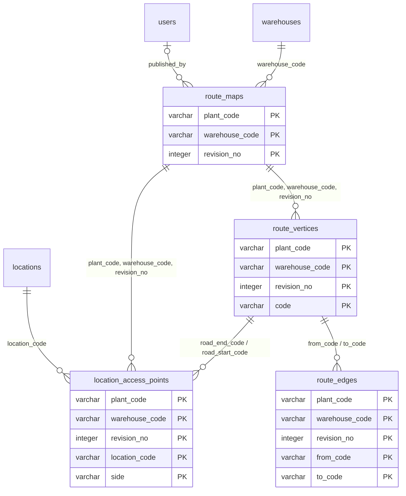

### `route_maps`

| Column | Type | NULL | Key | Default |
|---|---|---|---|---|
| `plant_code` | VARCHAR(10) |  | PK → `warehouses.plant_code` |  |
| `warehouse_code` | VARCHAR(20) |  | PK → `warehouses.code` |  |
| `revision_no` | INTEGER |  | PK |  |
| `status` | VARCHAR(12) |  |  |  |
| `default_approach_m` | NUMERIC(6, 2) |  |  | 3.00 |
| `published_at` | DATETIME2 | ✓ |  |  |
| `published_by` | VARCHAR(150) | ✓ | → `users.username` |  |
| `created_at` | DATETIME2 |  |  | sysutcdatetime() |
| `updated_at` | DATETIME2 |  |  | sysutcdatetime() |

Rules:

- CHECK `default_approach_m >= 0`
- CHECK `(status = 'draft' AND published_at IS NULL) OR (status = 'published' AND published_at IS NOT NULL) OR status = 'archived'`
- CHECK `revision_no >= 1`
- CHECK `route_maps.status IN ('draft', 'published', 'archived')`
- FK (plant_code, warehouse_code) → `warehouses` (plant_code, code)
- UNIQUE INDEX (plant_code, warehouse_code) WHERE status = 'draft'
- UNIQUE INDEX (plant_code, warehouse_code) WHERE status = 'published'

### `route_vertices`

| Column | Type | NULL | Key | Default |
|---|---|---|---|---|
| `plant_code` | VARCHAR(10) |  | PK → `route_maps.plant_code` |  |
| `warehouse_code` | VARCHAR(20) |  | PK → `route_maps.warehouse_code` |  |
| `revision_no` | INTEGER |  | PK → `route_maps.revision_no` |  |
| `code` | VARCHAR(30) |  | PK |  |
| `vertex_type` | VARCHAR(12) |  |  |  |
| `x` | NUMERIC(12, 4) |  |  |  |
| `y` | NUMERIC(12, 4) |  |  |  |
| `clearance_m` | NUMERIC(6, 2) |  |  | 3.00 |
| `created_at` | DATETIME2 |  |  | sysutcdatetime() |
| `updated_at` | DATETIME2 |  |  | sysutcdatetime() |

Rules:

- CHECK `clearance_m >= 0`
- CHECK `route_vertices.vertex_type IN ('corner', 'junction', 'gate', 'dock')`
- FK (plant_code, warehouse_code, revision_no) → `route_maps` (plant_code, warehouse_code, revision_no)

### `location_access_points`

Where a location's mouth meets a road, in one route revision.

| Column | Type | NULL | Key | Default |
|---|---|---|---|---|
| `plant_code` | VARCHAR(10) |  | PK → `locations.plant_code` → `route_maps.plant_code` → `route_vertices.plant_code` |  |
| `warehouse_code` | VARCHAR(20) |  | PK → `locations.warehouse_code` → `route_maps.warehouse_code` → `route_vertices.warehouse_code` |  |
| `revision_no` | INTEGER |  | PK → `route_maps.revision_no` → `route_vertices.revision_no` |  |
| `location_code` | VARCHAR(50) |  | PK → `locations.code` |  |
| `side` | VARCHAR(12) |  | PK |  |
| `road_start_code` | VARCHAR(30) |  | → `route_vertices.code` |  |
| `road_end_code` | VARCHAR(30) |  | → `route_vertices.code` |  |
| `road_side` | VARCHAR(12) |  |  |  |
| `offset_ratio` | NUMERIC(9, 6) |  |  |  |
| `allow_putaway` | BIT |  |  |  |
| `allow_pick` | BIT |  |  |  |
| `approach_override_m` | NUMERIC(6, 2) | ✓ |  |  |
| `created_at` | DATETIME2 |  |  | sysutcdatetime() |
| `updated_at` | DATETIME2 |  |  | sysutcdatetime() |

Rules:

- CHECK `allow_putaway = 1 OR allow_pick = 1`
- CHECK `approach_override_m IS NULL OR approach_override_m >= 0`
- CHECK `offset_ratio BETWEEN 0 AND 1`
- CHECK `location_access_points.road_side IN ('left', 'right')`
- CHECK `road_start_code < road_end_code`
- CHECK `location_access_points.side IN ('front', 'back')`
- FK (location_code, plant_code, warehouse_code) → `locations` (code, plant_code, warehouse_code)
- FK (plant_code, warehouse_code, revision_no) → `route_maps` (plant_code, warehouse_code, revision_no)
- FK (plant_code, warehouse_code, revision_no, road_end_code) → `route_vertices` (plant_code, warehouse_code, revision_no, code)
- FK (plant_code, warehouse_code, revision_no, road_start_code) → `route_vertices` (plant_code, warehouse_code, revision_no, code)
- INDEX (location_code, plant_code, warehouse_code)

### `route_edges`

One direction of a road. A two-way road has two rows.

| Column | Type | NULL | Key | Default |
|---|---|---|---|---|
| `plant_code` | VARCHAR(10) |  | PK → `route_vertices.plant_code` |  |
| `warehouse_code` | VARCHAR(20) |  | PK → `route_vertices.warehouse_code` |  |
| `revision_no` | INTEGER |  | PK → `route_vertices.revision_no` |  |
| `from_code` | VARCHAR(30) |  | PK → `route_vertices.code` |  |
| `to_code` | VARCHAR(30) |  | PK → `route_vertices.code` |  |
| `distance_m` | NUMERIC(8, 2) |  |  |  |
| `distance_source` | VARCHAR(12) |  |  |  |
| `created_at` | DATETIME2 |  |  | sysutcdatetime() |
| `updated_at` | DATETIME2 |  |  | sysutcdatetime() |

Rules:

- CHECK `distance_m > 0`
- CHECK `route_edges.distance_source IN ('calculated', 'manual')`
- CHECK `from_code <> to_code`
- FK (plant_code, warehouse_code, revision_no, from_code) → `route_vertices` (plant_code, warehouse_code, revision_no, code)
- FK (plant_code, warehouse_code, revision_no, to_code) → `route_vertices` (plant_code, warehouse_code, revision_no, code)

## Feature: tasks

*optional*

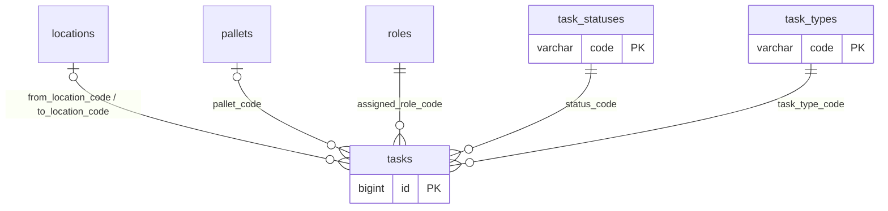

### `task_statuses`

*lookup, seeded by each factory*

Task statuses, seeded by each factory (e.g. open, done, cancelled).

| Column | Type | NULL | Key | Default |
|---|---|---|---|---|
| `code` | VARCHAR(30) |  | PK |  |
| `name` | NVARCHAR(100) |  |  |  |

### `task_types`

*lookup, seeded by each factory*

Kinds of work, seeded by each factory (e.g. putaway, pick, qc_check).

| Column | Type | NULL | Key | Default |
|---|---|---|---|---|
| `code` | VARCHAR(30) |  | PK |  |
| `name` | NVARCHAR(100) |  |  |  |

### `tasks`

*interface `TaskBase`, implemented by `examples.reference_factory.models.Task`*

**SDK:** Interface for the `tasks` table: one row per piece of work. The SDK fixes only the id, type and status; the factory adds everything else (who it is for, pallet, from / to, vehicle ...) and configures:

- `active_statuses`: statuses that mean "not finished yet"
- `reservation_columns`: columns that, on an active task, reserve a place, e.g. ("to_location_code",) or with level / slot. The SDK adds a unique index so two active tasks cannot reserve the same place.
- `transitions`: allowed status changes for `set_task_status` (None = the status a new task may start in)

**Factory:** Forklift, QC and dispatch work. Assigned to a role; whoever of that role takes it is recorded in the event log. Reserves the destination position (location + level + slot) while active.

| Column | Type | NULL | Key | Default |
|---|---|---|---|---|
| `id` | BIGINT |  | PK |  |
| `task_type_code` | VARCHAR(30) |  | → `task_types.code` |  |
| `status_code` | VARCHAR(30) |  | → `task_statuses.code` |  |
| `assigned_role_code` ⁽ᶠ⁾ | VARCHAR(30) |  | → `roles.code` |  |
| `pallet_code` ⁽ᶠ⁾ | VARCHAR(50) | ✓ | → `pallets.code` |  |
| `from_location_code` ⁽ᶠ⁾ | VARCHAR(50) | ✓ | → `locations.code` |  |
| `to_location_code` ⁽ᶠ⁾ | VARCHAR(50) | ✓ | → `locations.code` |  |
| `to_level_no` ⁽ᶠ⁾ | SMALLINT | ✓ |  |  |
| `to_slot_no` ⁽ᶠ⁾ | SMALLINT | ✓ |  |  |
| `reference` ⁽ᶠ⁾ | VARCHAR(50) | ✓ |  |  |
| `created_at` | DATETIME2 |  |  | sysutcdatetime() |
| `updated_at` | DATETIME2 |  |  | sysutcdatetime() |

Rules:

- CHECK `(to_level_no IS NULL AND to_slot_no IS NULL) OR (to_level_no IS NOT NULL AND to_slot_no IS NOT NULL AND to_location_code IS NOT NULL)`
- INDEX (from_location_code)
- INDEX (pallet_code)
- INDEX (status_code, task_type_code)
- INDEX (to_location_code)
- UNIQUE INDEX (to_location_code, to_level_no, to_slot_no) WHERE status_code IN ('open', 'in_progress') AND to_location_code IS NOT NULL AND to_level_no IS NOT NULL AND to_slot_no IS NOT NULL

## Example: reference_factory

*factory tables, not part of the SDK*

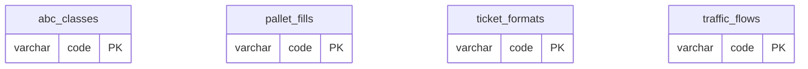

### `abc_classes`

*lookup, seeded by each factory*

ABC classification: A = fastest-moving goods.

| Column | Type | NULL | Key | Default |
|---|---|---|---|---|
| `code` | VARCHAR(30) |  | PK |  |
| `name` | NVARCHAR(100) |  |  |  |

### `pallet_fills`

*lookup, seeded by each factory*

Whether a zone holds full pallets or partial (fraction) pallets.

| Column | Type | NULL | Key | Default |
|---|---|---|---|---|
| `code` | VARCHAR(30) |  | PK |  |
| `name` | NVARCHAR(100) |  |  |  |

### `ticket_formats`

*lookup, seeded by each factory*

| Column | Type | NULL | Key | Default |
|---|---|---|---|---|
| `code` | VARCHAR(30) |  | PK |  |
| `name` | NVARCHAR(100) |  |  |  |

### `traffic_flows`

*lookup, seeded by each factory*

How forklifts may move through a zone (one-way / two-way).

| Column | Type | NULL | Key | Default |
|---|---|---|---|---|
| `code` | VARCHAR(30) |  | PK |  |
| `name` | NVARCHAR(100) |  |  |  |
