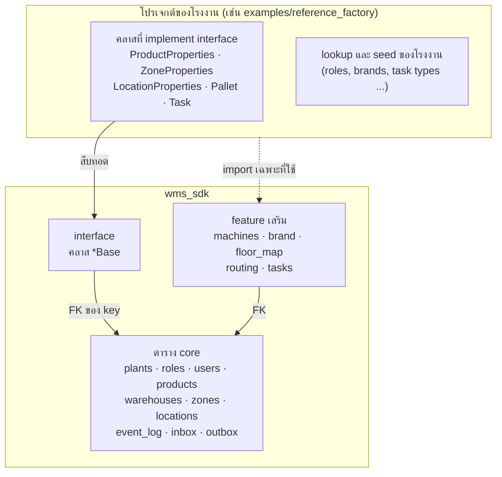
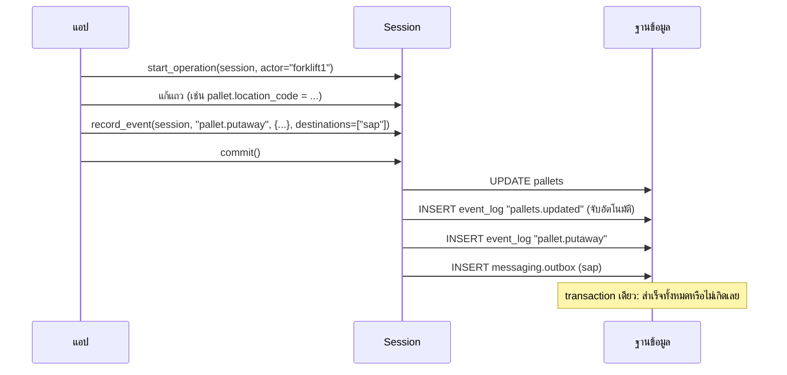

# ภาพรวม

**ภาษาไทย** | [English](../en/overview.md)

WMS SDK คือแบบฐานข้อมูลคลังสินค้าที่ใช้ร่วมกันได้หลายโรงงาน เป็น Python package ที่มี model ของ SQLAlchemy และฟังก์ชันช่วยอีกเล็กน้อย แต่ละโรงงานติดตั้ง SDK แล้วสร้างโปรเจกต์ของตัวเองต่อจากนั้น

## ในกล่องมีอะไร

| ชั้น | คืออะไร | ใครเขียน |
|---|---|---|
| **core** | ตารางที่ทุกคลังต้องมี | SDK |
| **interface** | ตารางที่ SDK กำหนด key ส่วนคอลัมน์อื่นโรงงานเพิ่มเอง | SDK: key; โรงงาน: คอลัมน์ |
| **feature** | ตารางและฟังก์ชันเสริม ไม่ import ก็ไม่มี | SDK |
| **โปรเจกต์ของโรงงาน** | คลาสที่ implement, lookup, seed, migration และตัวแอป | โรงงาน |

ทำไมออกแบบแบบนี้: [แนวคิดการออกแบบ](concepts.md) ถ้าเจอศัพท์ที่ไม่คุ้น: [อภิธานศัพท์](glossary.md)

## เกิดอะไรขึ้นเมื่อผู้ใช้กดหนึ่งครั้ง

- **สถานะปัจจุบัน** อยู่ในตาราง (`pallets`, `locations`, `tasks` ...)
- **ประวัติ** อยู่ใน `event_log` เขียนใน transaction เดียวกัน
- **ข้อความถึงระบบอื่น** รออยู่ใน `messaging.outbox` จนกว่า worker จะส่ง

รายละเอียด: [event log, inbox, outbox](events.md)

## เริ่มอ่านจากไหน

| ต้องการ | อ่าน |
|---|---|
| เข้าใจแบบ | หน้านี้ → [แนวคิดการออกแบบ](concepts.md) → [อภิธานศัพท์](glossary.md) |
| สร้างโปรเจกต์ของโรงงาน | [การติดตั้ง](installation.md) → [Tutorial](tutorial.md) → [สร้างโปรเจกต์ของโรงงาน](factory-guide.md) |
| เขียนโค้ดของแอป | [ตัวอย่าง](examples.md) → [stock, พาเลท และ QC](inventory.md) → [feature เสริม](features.md) → [API reference](api.md) |
| แก้ตัว SDK | [เริ่มต้น](getting-started.md) → [CLAUDE.md](../../CLAUDE.md) |
| แก้ error | [แก้ปัญหา](troubleshooting.md) |
| ดูตาราง | [Schema reference](schema.md) |
